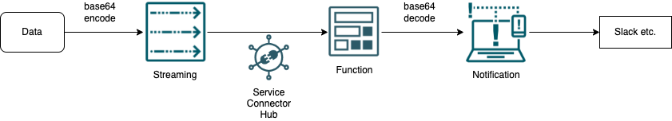
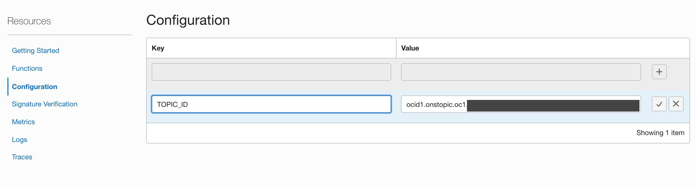

# sch2ntf
This is Function script to notify data submitted to Streaming using Notifications on OCI(Oracle Cloud Infrastructure).

Using the Service Connector Hub, it is easy to link Streaming to Notification, but the data input to Streaming must be encoded in base64, the notification message will be encoded in base64. In order to notify the message as decoded one, this script makes the message base64 decoded data.

 

# How to use
As a preliminary preparation, set up the environment to run the function according to the following URL.
https://docs.oracle.com/en-us/iaas/Content/Functions/Tasks/functionsquickstartcloudshell.htm#functionsquickstart_cloudshell

Download
```
git clone git@github.com:hamaryo/sch2ntf.git
```

Build and Deploy
```
cd sch2ntf/src
fn -v deploy --app application
```

Configure TOPIC_OCID to the Fucntion


Test
```
oci streaming stream message put --messages file://data/file.json --stream-id [Streaming OCID] --endpoint [Streming Endpoint]
```

# Reference
* 日本語解説記事は[こちら](https://hamaryo.hatenablog.com/entry/2022/02/12/175436?_ga=2.196941420.1950284873.1644649021-1909767555.1641391165)